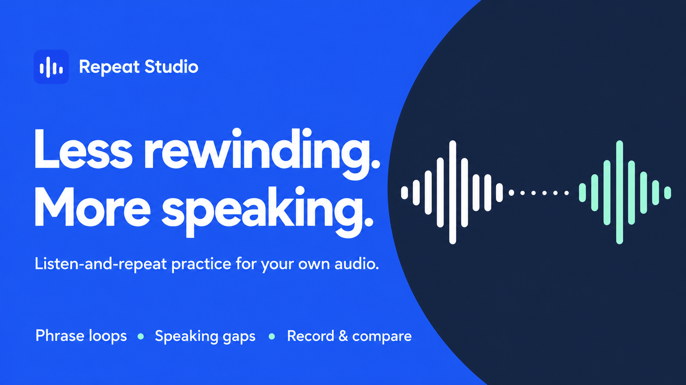

# Repeat Studio

**Listen-and-repeat audio practice player.** Less rewinding. More speaking.

Turn your own audio recordings into focused speaking practice. Mark a phrase, slow it down, leave a quiet gap to say it yourself, then record your take and compare it with the original.

## Try it now

No install, no account, no internet needed. Just open `Repeat-Studio.html` in a desktop browser.

Or download the latest release ZIP and extract it anywhere.

## What it does

- Import your own audio (up to 80 MB / 90 minutes)
- Mark and name up to 100 phrases
- Loop phrases at 0.5x to 1.5x speed
- Insert a speaking gap so you have time to talk
- Record one take per phrase (up to 2 minutes) and compare with the original
- Save your session (audio + phrases + recordings) and reopen it later

## What it doesn't do

No transcription, no translations, no pronunciation scoring, no cloud sync, no automatic phrase detection. It's a focused practice tool, not a course.

## Included demo

A four-phrase English sample with synthetic voice so you can try the controls immediately. Bring your own recordings for real practice.

## Compatibility

Designed for desktop browsers. Audio format support varies by browser. Recording needs a working microphone and browser permission. Mobile is not guaranteed.

## Files

| File | What it is |
|------|-----------|
| `Repeat-Studio.html` | The complete player (self-contained, works offline) |
| `Start-here.html` | Quick-start guide |
| `README.txt` | Plain-text instructions |
| `Audio-credits.txt` | Sample audio credit |

## License

Free for personal and commercial practice use. The sample audio is synthetic (Flite SLT voice); see `Audio-credits.txt`.

---

Made by [Saxena Wave](https://saxenawave41.gumroad.com)
